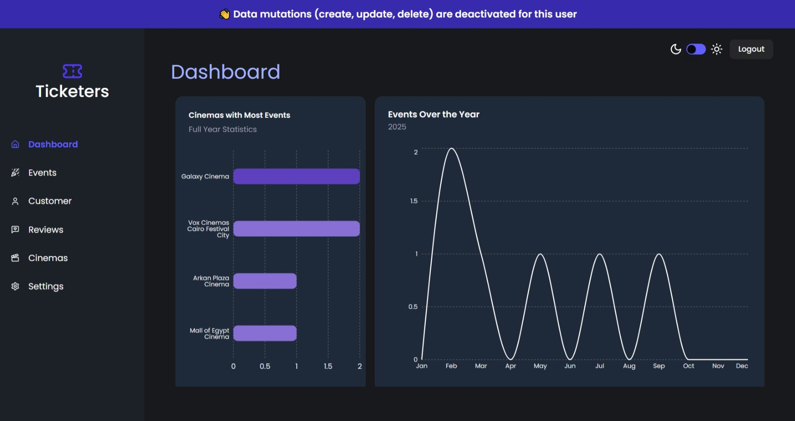

# Tickters Admin


Welcome to **Tickters Admin**, a comprehensive dashboard for managing cinema ticketing. This project integrates Sanity as a headless CMS, React Query for efficient data fetching, and role-based authentication to ensure that only authorized users (admin or preview) can access specific features.

---

## 🚀 **Live Preview**

Explore the live version: [Tickters Admin](https://ticketers-admin.vercel.app/)

---

## 🛠️ **Technologies Used**

### **Core Stack**

- **Vite** (v5.3.4): Next-generation frontend tooling.
- **React** (v18.3.1): Library for building user interfaces.
- **TypeScript** (v5.2.2): Adds static type checking.
- **Tailwind CSS** (v3.4): Utility-first CSS framework.
  - `tailwind-merge` (v3.0.1): For merging Tailwind classes.
- **React Router** (v7.1.5): Client-side routing.

### **Data & State Management**

- **Sanity.io**: Headless CMS for managing content.
  - `@sanity/client` (v6.28.0): Sanity client for data operations.
- **React Query** (`@tanstack/react-query` v5.66.5): For data fetching and caching.
- **bcryptjs** (v3.0.2): For password hashing.

### **UI & UX**

- **Radix UI**: Accessible UI components.
- **react-hot-toast** (v2.5.2): For toast notifications.
- **react-error-boundary** (v5.0.0): For error handling.
- **Lucide React** (v0.475.0): Icon library.

---

## 📂 **Project Structure**

```plaintext
tickters-admin/
├── public/          # Static assets (e.g., favicon, images)
├── src/
│   ├── assets/      # Static assets (e.g., favicon, images)
│   ├── components/  # Reusable UI components (Spinner, ErrorFallback, etc.)
│   ├── context/     # React contexts (e.g., AuthContext)
│   ├── hooks/       # Custom hooks (React Query hooks, etc.)
│   ├── lib/         # API functions and utilities (Sanity client, etc.)
│   ├── pages/       # Page components (Dashboard, Customers, etc.)
│   ├── routes/      # Route protection (RequireAuth, PublicRoute, NotFound)
│   └── main.tsx     # Application entry point
├── .env             # Environment variables
├── package.json
└── README.md
```

---

- `npm run dev` - Start the development server.
- `npm run build` - Build a production-ready version of the app.
- `npm run preview` - Preview the production build.
- `npm run lint` - Run linting for the codebase.

---

## App Screenshot



---

## 🌟 **Key Features**

- `Role-Based Authentication:` Admin users can perform CRUD operations while preview users have read-only access.

- `Data Management:` Manage cinemas, events, customers, and reviews through a robust admin panel.

- `Lazy Loading & Error Handling:` Components are lazily loaded and errors are gracefully handled with react-error-boundary and toast notifications.

- `CMS Integration:` All content is managed via Sanity.io, including image uploads and dynamic data.

- `Modern UI & UX:` Built with Tailwind CSS, Radix UI, and responsive design best practices.

---

## 🎬 Demo

Explore the live version: [Tickters Admin](https://ticketers-admin.vercel.app/)

---

## 📜 **License**

This project is licensed under the MIT License. See the [LICENSE](LICENSE) file for details.

---

## 👤 **Author**

**[Adel Yasser](https://github.com/dola5xd)**  
Feel free to reach out or contribute to this project!

---

## 📧 **Contact**

If you have any questions or feedback, contact me at: [dolay6253@gmail.com](mailto:dolay6253@gmail.com)
